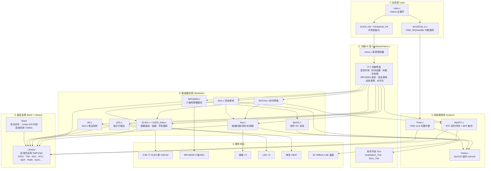
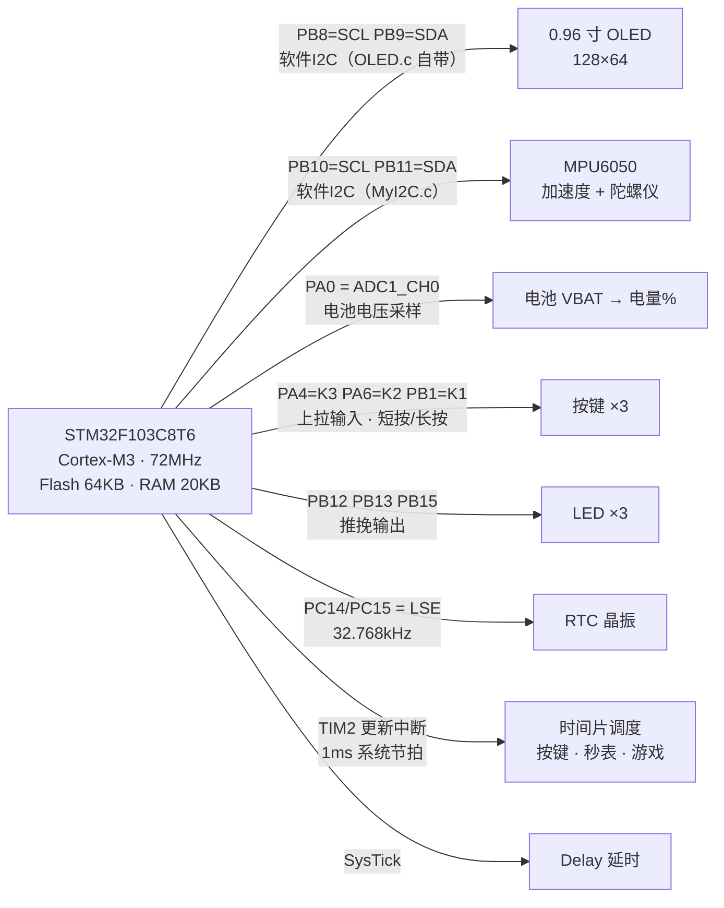

# STM32 可编程多功能手表 —— 项目架构图

> 工程：Keil µVision5（ARMCC V5.06）｜芯片：**STM32F103C8T6**（Cortex-M3，72MHz，Flash 64KB / RAM 20KB）｜外设库：STM32F10x 标准外设库（StdPeriph）

---

## 一、代码仓库目录结构

```
Code/
├── Project.uvprojx          # Keil 工程文件
├── User/                    # ① 应用层：主函数、中断服务
│   ├── main.c               #   主循环 + TIM2 中断（软件节拍调度）
│   ├── stm32f10x_it.c/.h    #   中断服务函数
│   └── stm32f10x_conf.h     #   外设库配置头
├── Hardware/                # ② 板级驱动层 + 功能/UI 层
│   ├── OLED.c/.h            #   0.96" OLED 驱动 + 绘图库（软件I2C）
│   ├── OLED_Data.c/.h       #   字库 + 图标图片数据
│   ├── MyI2C.c/.h           #   软件 I2C 总线（位操作模拟）
│   ├── MPU6050.c/.h         #   六轴传感器驱动（+ MPU6050_Reg.h 寄存器表）
│   ├── Key.c/.h             #   按键扫描（消抖 + 长短按）
│   ├── LED.c/.h             #   指示灯驱动
│   ├── AD.c/.h              #   ADC 电池电压采样
│   ├── menu.c/.h            #   UI 菜单控制器（全部功能界面）
│   ├── SetTime.c/.h         #   校时界面
│   └── dino.c/.h            #   恐龙快跑小游戏
├── System/                  # ③ 系统服务层
│   ├── Delay.c/.h           #   SysTick 软件延时（us/ms/s）
│   ├── Timer.c/.h           #   TIM2 1ms 时基中断
│   └── MyRTC.c/.h           #   RTC 实时时钟 + BKP 备份寄存器
├── Library/                 # ④ STM32F10x 标准外设库（StdPeriph）
│   └── stm32f10x_*.c/.h     #   GPIO TIM ADC RTC BKP PWR NVIC I2C …
├── Start/                   # ⑤ 启动与内核
│   ├── startup_stm32f10x_md.s   # 启动文件（中容量 Flash 64KB）
│   ├── core_cm3.c/.h            # Cortex-M3 内核（CMSIS）
│   ├── stm32f10x.h              # 寄存器定义
│   └── system_stm32f10x.c/.h    # 系统时钟初始化（72MHz）
├── Objects/  Listings/  DebugConfig/   # 编译输出产物（可忽略）
└── Garbage/                          # 废弃备份（EIDE/VSCode 残留，可忽略）
```

---

## 二、软件分层架构图



---

## 三、外设资源与引脚分配图



### 外设资源一览表

| MCU 外设 | 引脚 | 驱动模块 | 用途 |
|---|---|---|---|
| GPIOB 模拟 I2C | PB8 / PB9 | `OLED.c` | 0.96" OLED 屏幕（软件 I2C） |
| GPIOB 模拟 I2C | PB10 / PB11 | `MyI2C.c` → `MPU6050.c` | 六轴传感器 MPU6050 |
| ADC1 通道 0 | PA0 | `AD.c` | 电池电压采样 → 电量百分比 |
| GPIOA/B 输入 | PA4 / PA6 / PB1 | `Key.c` | 3 个按键（K1/K2/K3，K3 支持长按） |
| GPIOB 推挽输出 | PB12 / PB13 / PB15 | `LED.c` | 指示灯 / 手电筒 |
| TIM2 | 内部时钟 | `Timer.c` | 1ms 时基中断，驱动各模块 Tick |
| RTC + BKP + PWR | PC14/PC15（LSE） | `MyRTC.c` | 实时时钟（年月日时分秒），掉电保存 |
| SysTick | 内核 | `Delay.c` | 微秒/毫秒/秒级延时 |

---

## 四、功能与应用一览

| 功能 | 入口 | 依赖模块 | 说明 |
|---|---|---|---|
| 首页时钟 | `First_Page_Clock()` | MyRTC、AD、OLED | 显示日期时间 + 电池图标电量 |
| 时间设置 | `SettingPage()` / `SetTime()` | MyRTC、Key、OLED | 按键调整 RTC 时间 |
| 秒表 | `StopWatch()` | Timer Tick、Key、OLED | 1ms 节拍计时，多状态切换 |
| 手电筒 | `LED()` | LED、Key、OLED | 控制 LED 亮灭 |
| 姿态显示 | `MPU6050()` | MPU6050、OLED | 读取六轴数据绘图 |
| 恐龙游戏 | `Game()` / `dino.c` | OLED、Key、Timer Tick | 跳跃躲避小游戏 |
| 动态表情 | `Emoji()` | OLED、Key | 表情动画 |
| 水平仪 | `Gradienter()` | MPU6050、OLED、math | 根据倾角绘制水平指示 |

---

## 五、嵌入式学习要点（如何读懂这个工程）

1. **程序入口**：`main.c` → 先初始化 OLED，再 `Peripheral_Init()`（`menu.c` 中统一初始化 RTC/按键/LED/MPU6050/ADC），最后进入 `while(1)` 轮询按键 → 首页时钟/菜单跳转。
2. **前后台系统**：前台是 `while(1)` 主循环（轮询按键、刷新界面），后台是 TIM2 中断（每 1ms 执行 `Key_Tick / StopWatch_Tick / Dino_Tick` 等软件节拍，实现消抖、计时、游戏动画）。
3. **软件 I2C**：`OLED` 与 `MPU6050` 均用 GPIO 位操作模拟 I2C 时序（`OLED.c` 自带、`MyI2C.c` 通用），适合初学者理解 I2C 协议；`MPU6050.c` 通过 `MyI2C` 读写寄存器。
4. **分层思想**：`Hardware/`（驱动）只做"某外设怎么用"，`System/`（服务）提供"时间/延时/节拍"能力，`menu.c`（UI）组合二者实现功能，`main.c` 只负责初始化与调度 —— 这是嵌入式工程最常见的分层结构。
5. **标准外设库**：`Library/` 是 ST 官方 StdPeriph 库，所有底层寄存器操作都被封装为 `GPIO_Init`、`TIM_TimeBaseInit`、`RTC_` 等函数，`Start/` 提供启动代码与时钟初始化。
